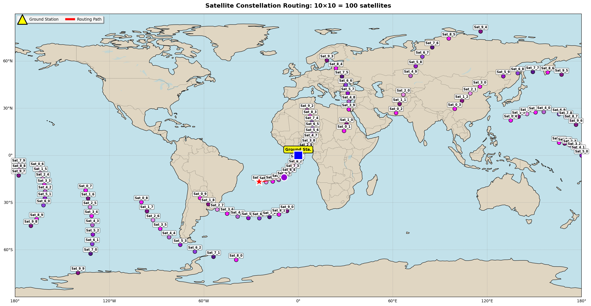
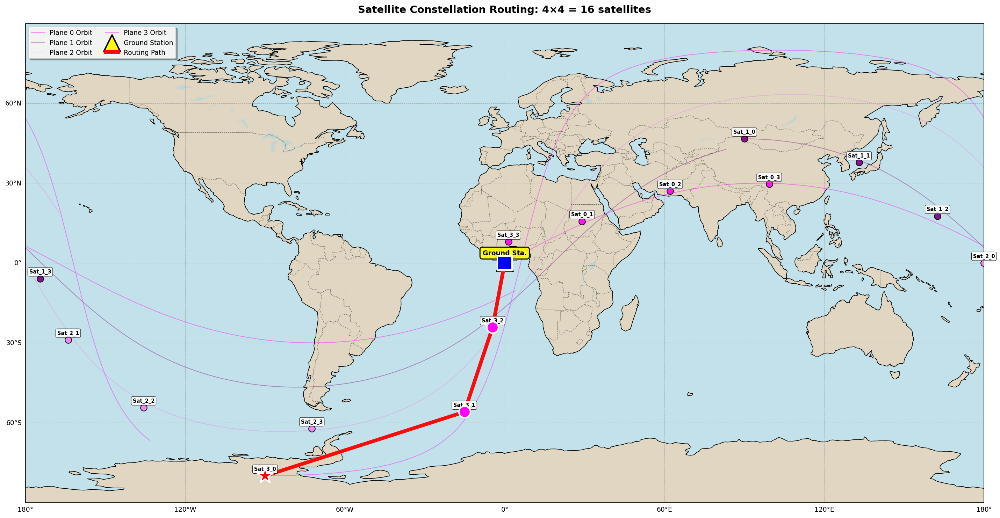

# CASAS Routing Challenge

A satellite network routing assignment for evaluating coding ability, networking fundamentals, space/orbital reasoning, and engineering judgment.

## Overview

This project provides a working satellite network simulator where you implement an adaptive routing strategy. The simulator handles orbital mechanics, visibility computation, and dynamic topology changes. Your task is to implement routing logic that adapts to the changing network topology.

### Key Features

- **Deterministic Simulation**: Orbital mechanics and topology changes are deterministic based on geometry
- **Dynamic Topology**: Links appear and disappear based on satellite visibility
- **Traffic Generation**: Periodic packet generation with configurable patterns
- **Baseline Routing**: Shortest-path routing provided as a baseline
- **Two Scenarios**: Stable (nominal conditions) and Disrupted (reduced connectivity)

## Understanding the Satellite Constellation Architecture

### Constellation Structure

The simulator uses a **Walker constellation** pattern, similar to real-world satellite networks like Starlink. Here's how it works:

#### Orbital Planes and Satellites

- **Orbital Planes**: Satellites are organized into multiple orbital planes that circle the Earth
- **Satellites per Plane**: Each plane contains multiple satellites evenly spaced around the orbit
- **Total Satellites**: `number_of_planes × sats_per_plane`

For example:
- **4×4 constellation**: 4 planes × 4 satellites = 16 satellites
- **10×10 constellation**: 10 planes × 10 satellites = 100 satellites

#### Orbital Parameters

Each orbital plane has unique characteristics:

1. **RAAN (Right Ascension of Ascending Node)**: Controls the rotation of the orbital plane around Earth's axis
   - Planes are evenly spaced: `RAAN = 360° / number_of_planes`
   - Example: 10 planes = 36° spacing between planes

2. **Inclination**: The tilt angle of the orbital plane relative to the equator
   - In this simulator, inclinations are automatically distributed from 30° to 80° across planes
   - This creates visually distinct orbital paths and better global coverage

3. **Mean Anomaly**: The position of each satellite within its orbital plane
   - Satellites are evenly spaced: `spacing = 360° / sats_per_plane`
   - Example: 10 satellites per plane = 36° spacing between satellites

#### Visual Example: 10×10 Constellation

The following visualization shows a **10×10 constellation (100 satellites)** on a world map, demonstrating:



**Key Elements in the Visualization:**

1. **Satellites (Purple Circles)**: Each satellite is labeled as `Sat_X_Y` where:
   - `X` = Orbital plane number (0-9 for 10 planes)
   - `Y` = Satellite number within that plane (0-9 for 10 satellites per plane)

2. **Orbital Paths (Colored Lines)**: Each colored line shows the **ground track** (orbital path projected onto Earth) for one satellite from each plane over ~90 minutes. These lines demonstrate:
   - How satellites move in their orbits
   - The sinusoidal pattern of ground tracks
   - Different orbital inclinations create different track patterns
   - Each plane has a distinct color to show orbital plane separation

3. **Ground Station (Yellow Triangle)**: The source of all traffic, located at the equator (0° latitude, 0° longitude)

4. **Routing Path (Red Line)**: Shows how packets travel from ground station to destination satellite through multiple hops

5. **World Map**: Provides geographical context showing where satellites are positioned relative to Earth's surface

#### How Links Are Formed

**Inter-Satellite Links (ISL)** are created when:
- Two satellites are within the **maximum ISL range** (5000 km in stable, 3000 km in disrupted)
- They have **line-of-sight** (not blocked by Earth)

**Ground Links** are created when:
- A satellite is within range of the ground station
- The satellite has sufficient **elevation angle** above the horizon (5° in stable, 15° in disrupted)

#### Why This Matters for Routing

- **Dynamic Topology**: As satellites orbit, links appear and disappear
- **Multi-hop Routing**: Packets often need multiple hops to reach distant satellites
- **Path Selection**: Your routing algorithm must choose paths that:
  - Minimize distance (like baseline)
  - Account for topology changes (adaptive routing)
  - Handle disrupted scenarios with reduced connectivity

The constellation architecture directly impacts routing performance - larger constellations (10×10) provide more connectivity options, especially in disrupted scenarios, while smaller constellations (4×4) may have network partitions under stress.

#### Routing Visualization Example: 4×4 Constellation

The following visualization shows a **4×4 constellation (16 satellites)** with routing paths on a sinusoidal world map projection. This demonstrates how routing works across different constellation scales:



**Key Elements in the Routing Visualization:**

1. **Satellites (Colored Circles)**: Each satellite is labeled and color-coded by orbital plane
   - Magenta/Pink = Plane 0
   - Purple = Plane 1
   - Other colors = Additional planes

2. **Orbital Paths (Colored Lines)**: Subtle ground tracks showing the sinusoidal orbital paths for one satellite from each plane over ~90 minutes

3. **Ground Station (Yellow Triangle)**: The source of all traffic, located at the equator

4. **Routing Path (Red Line)**: Shows the multi-hop path from ground station to destination satellite
   - Each segment represents one hop in the routing path
   - The path demonstrates how packets traverse the network using available links

5. **World Map Background**: Open-source map showing continents and oceans for geographical context

This visualization helps you understand:
- How routing paths are selected across the constellation
- How different constellation sizes affect routing complexity
- The relationship between satellite positions and routing hops
- How the same visualization can be generated for different constellation scales (4×4, 6×6, 8×8, 10×10, etc.)

When you test different constellation sizes for the scaling analysis, you can generate similar visualizations to compare how routing paths change with network size.

## Setup

### Requirements

- Python 3.10 or higher
- pip

### Installation

```bash
pip install -r requirements.txt
```

## Running the Simulator

### Basic Usage

Run a simulation with a specific scenario and router:

```bash
python run.py --scenario stable --router baseline
python run.py --scenario stable --router adaptive
python run.py --scenario disrupted --router baseline
python run.py --scenario disrupted --router adaptive
```

### Output

Each run generates a results file in `outputs/`:
- `outputs/results_stable_baseline.json`
- `outputs/results_stable_adaptive.json`
- `outputs/results_disrupted_baseline.json`
- `outputs/results_disrupted_adaptive.json`

### Visualization

**Results Comparison**: Generate comparison plots from all results:

```bash
python plots/plot_results.py
```

**Topology Visualization**: Visualize the constellation and routing paths:

```bash
python plots/visualize_topology.py
```

This generates a sample visualization showing:
- 3D view of satellite constellation
- Network topology (all links)
- Example routing path from ground station to destination (multi-hop path)
- Network statistics

The sample visualization shows a multi-hop routing path (at least 3 hops) to demonstrate how packets traverse the network. Plots are saved to `outputs/plots/`.

## Testing

Run the test suite:

```bash
python -m pytest
```

## Project Structure

```
casas-routing-challenge/
├── README.md                 # This file
├── requirements.txt          # Python dependencies
├── run.py                    # Main execution script
├── report_template.md        # Template for your report
├── model_card_template.md    # Template for ML model documentation
├── data/
│   ├── constellation.yaml    # Constellation parameters (see data/README.md for details)
│   └── README.md              # Configuration guide for students 
├── sim/                      # Core simulation components
│   ├── orbit.py              # Orbit propagation
│   ├── visibility.py         # Line-of-sight computation
│   ├── topology.py           # Dynamic graph construction
│   ├── traffic.py            # Packet generation
│   ├── metrics.py            # Metrics computation
│   └── simulator.py          # Main simulation loop
├── routing/                  # Routing implementations
│   ├── baseline.py           # Baseline shortest-path router
│   └── adaptive.py           # YOUR IMPLEMENTATION HERE
├── experiments/              # Scenario configurations
│   ├── scenario_stable.py
│   └── scenario_disrupted.py
├── plots/                    # Visualization scripts
│   └── plot_results.py
├── outputs/                  # Results and plots
│   └── .gitkeep
└── tests/                    # Test suite
    ├── test_visibility.py
    └── test_routing_baseline.py
```

## Your Task

### Implementation

Implement your adaptive routing strategy in `routing/adaptive.py`. The file contains a stub with the expected interface.

**Important Note**: Currently, `adaptive.py` uses a **random fallback** (randomly picks a neighbor) for testing purposes. This performs poorly compared to baseline shortest-path routing. You must implement your adaptive strategy to improve performance and beat the baseline.

**Router Interface:**
```python
def get_next_hop(self, packet, topology, time, history):
    """
    Args:
        packet: Packet object with src, dst, current_node, ttl_remaining
        topology: NetworkX graph of current network state
        time: Current simulation time (seconds)
        history: List of previous topology states (optional)
    
    Returns:
        next_hop: Node ID to route to, or None if no route available
    """
```

### Approach Options

You may implement either:
1. **Heuristic-based routing**: Use graph properties, topology predictions, or other heuristics
2. **ML-based routing**: Use scikit-learn or small PyTorch models (see constraints below)

### ML Constraints (if using ML)

- Training must complete on CPU in < 2-3 minutes
- No GPUs required
- No long RL training loops
- Must include fallback to baseline if inference fails
- Document in `model_card.md`:
  - Features used
  - Model type
  - Training data source
  - Inference cost estimate

**Allowed ML libraries:**
- scikit-learn
- torch (small models only)

**Disallowed:**
- Large RL frameworks
- Distributed training
- AutoML
- Black-box simulators

### Deliverables

1. **Implementation**: Complete `routing/adaptive.py`
2. **Results**: Run all four combinations (stable/disrupted × baseline/adaptive) with default constellation
3. **Constellation Scaling Analysis** (REQUIRED): Test your routing with different network sizes
4. **Report**: Fill out `report_template.md` with:
   - Your routing idea
   - Features/state used
   - When it helps vs. when it fails
   - Scaling analysis results
5. **Model Card** (if using ML): Fill out `model_card_template.md`

### Constellation Scaling Analysis (REQUIRED)

**You must test your routing strategy with different constellation sizes to analyze scalability.**

The default configuration starts with **4 planes × 4 satellites = 16 satellites** (plus ground station = 17 nodes).

**Required Steps:**

1. **Test with default configuration (4×4)**:
   ```bash
   python run.py --scenario stable --router adaptive
   ```

2. **Test with progressively larger constellations**:
   Modify `data/constellation.yaml` (see `data/README.md` for detailed configuration guide) and test at least 3 different sizes:
   - **Small**: 4 planes × 4 sats = 16 satellites (default)
   - **Medium**: 6 planes × 6 sats = 36 satellites
   - **Large**: 8 planes × 8 sats = 64 satellites
   - **Optional**: Test even larger (e.g., 10×10 = 100 satellites)

   Keep other parameters (altitude, inclination) the same for fair comparison.

3. **For each configuration, run**:
   ```bash
   python run.py --scenario stable --router adaptive
   python run.py --scenario stable --router baseline  # For comparison
   ```

4. **Analyze and document**:
   - How does **delivery rate** change with network size?
   - How does **latency** change (mean, median, p95)?
   - How does **computation time** scale? (Does routing get slower?)
   - Does your routing strategy scale well, or does performance degrade?
   - At what point does the network become too dense/sparse?
   - What are the trade-offs between more satellites vs. better routing?
   - Compare your adaptive router vs. baseline at each size

5. **Include findings in report**: Document results in the "Constellation Scaling Analysis" section of your report.

### Topology Visualization (Optional but Recommended)

**Create a visualization showing routing paths from ground station to satellite.**

The default destination is automatically set to a **random satellite** that is consistently selected for the same constellation size. This ensures:
- The same random satellite is used across all experiments for the same constellation size (reproducible)
- Different constellation sizes get different random destinations
- Multi-hop routing is still likely since the destination is randomly distributed across all planes

The random selection is deterministic (based on a hash of the constellation size), so results are reproducible while still testing routing to various satellite locations.

You can use `plots/visualize_topology.py` as a reference. Modify it or create your own visualization that shows:

1. **Constellation layout**: All satellites and ground station positions
2. **Network topology**: Active links between nodes
3. **Routing paths**: Show how packets are routed from source to destination
   - Use different colors/styles for baseline vs. adaptive routing
   - Show multiple paths if your adaptive router explores alternatives
   - Highlight path differences between routers

**Ideas for visualization**:
- 3D plot of satellite positions with routing paths
- Network graph showing topology and paths
- Time-lapse showing how paths change as topology evolves
- Comparison of baseline vs. adaptive routing paths

Include your visualization in your report or as a separate file.

## How It Works

### Simulation Model

- **Time**: Discrete timesteps of 1 second, total duration 600 seconds
- **Packets**: Store-and-forward, one hop per timestep
- **Topology**: Rebuilt every timestep from current satellite positions
- **Packet Loss**: Occurs due to TTL expiration or no available path (not randomness)

### Routing Model

**Global Topology Awareness**: The routing model uses **global/omniscient routing** - each router has access to the **complete network topology** when making routing decisions.

- When `get_next_hop()` is called, the router receives:
  - **`topology`**: Complete NetworkX graph with all nodes and active links
  - **`history`**: Recent topology states (last 10 timesteps)
  - **`time`**: Current simulation time

- This means routers can see:
  - All nodes in the network (all satellites + ground station)
  - All active links between any nodes
  - Link distances (edge weights)
  - Historical topology changes

- **Note**: This is a simplified model for the assignment. In real distributed systems, nodes typically only know about their neighbors. Here, the global view allows you to focus on routing algorithms rather than distributed routing protocols.

### Packet Structure

Each packet is a **single object** that travels through the network - the same packet object moves from sender to receiver, with its state updated in place.

Packet attributes:
- `id`: Unique identifier (never changes)
- `src`, `dst`: Source and destination nodes (never change)
- `created_at`: Creation timestamp (never changes)
- `current_node`: Current location (updated as packet moves)
- `ttl_remaining`: Time to live remaining (decremented each timestep)
- `delivered_at`: Delivery timestamp (set when delivered)
- `drop_reason`: Reason for drop (set if dropped)

**Important**: The router receives the **same packet object** at each hop. The packet's `current_node` is updated when it moves (`packet.move_to(next_node)`), but it's the same object throughout its journey.

### Metrics

The simulator computes:
- Total packets sent
- Total packets delivered
- Delivery success rate
- Latency statistics (mean, median, p95)
- Drop reasons count

## Constraints

- **Core task**: Only modify `routing/adaptive.py` and optionally add helper files under `routing/`
- **Scaling analysis**: You MUST modify `data/constellation.yaml` to test different network sizes (see Constellation Scaling Analysis above)
- **DO NOT modify**: Orbital mechanics code (`sim/orbit.py`) or other core simulation components
- **Deterministic**: All behavior must be deterministic (seed randomness if used)

**Note**: Start with the default constellation (4×4) for your main routing implementation, then test with larger sizes for the required scaling analysis.

## Evaluation Criteria

We evaluate:
1. **Coding ability**: Clean, readable code in an existing codebase
2. **Networking fundamentals**: Understanding of routing, latency, packet loss
3. **Space/orbital reasoning**: Handling contact-driven topology dynamics
4. **Engineering judgment**: Appropriate use of heuristics vs. ML, simplicity vs. overengineering

## Current Implementation Status

- **Baseline Router** (`routing/baseline.py`): Fully implemented using Dijkstra shortest-path algorithm
- **Adaptive Router** (`routing/adaptive.py`): Currently uses a random fallback (poor performance). **You must implement your adaptive routing strategy here.**

When you run the simulations initially, you'll see:
- Baseline: Good performance (shortest path routing)
- Adaptive: Poor performance (random routing) - this is expected until you implement your strategy

Your goal is to implement an adaptive routing strategy that performs as well as or better than baseline.

## Questions?

Review the codebase to understand the simulation model. The baseline router (`routing/baseline.py`) provides a reference implementation showing how to use NetworkX for shortest-path routing.

Good luck!
